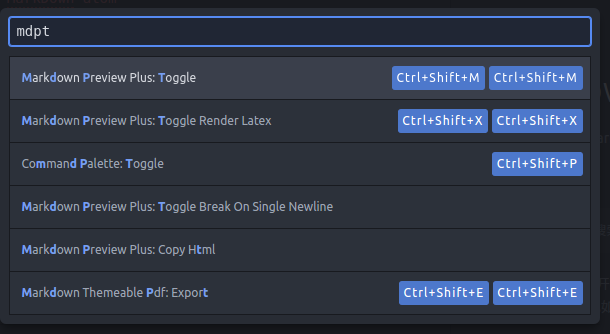

# MarkDown-atom
## 一、安装atom，并打开MarkDown Preview
这是一个atom和markdown语法的简易教程。Markdown是一种可以使用普通文本编辑器编写的标记语言，通过简单的标记语法，它可以使普通文本内容具有一定的格式。Atom 是 GitHub 专门为程序员推出的一个跨平台文本编辑器。具有简洁和直观的图形用户界面，并有很多有趣的特点：支持 CSS，HTML，JavaScript 等网页编程语言。  

1. 安装atom  -->

        直接百度搜索进入atom官网下载atom并安装
2. 安装atom打开主界面，选择 file->newfile 新建一个文件，后缀名为`.md` ,比如`example.md`

3. 选择该文件，按`ctrl-shift + p` 键，进入会弹出一个输入框，输入mdpt，选择`MarkDown Preview-Toggle`命令。会弹出一个MarkDown语法渲染后的效果的窗口。  
**一般atom安装后默认支持markedown语法**
  
上图中我的是`MarkDown Preview Plus：Toggle`，这是因为我安装了markdown的扩展版的插件，默认为`MarkDown Preview：Toggle`

4. 这时编辑新建的文件，对应的弹出的markdown preview 窗口也会同步地渲染markdown语法。
比如在新建的文件里输入  
```
# The largest heading
## The second largest heading
###### The smallest heading
```

## 二、markdown语法
这部分可以参考github上的[GitHub flavored markdown](https://help.github.com/categories/writing-on-github/) 这是英文版的，但是借助[google 翻译](https://translate.google.cn/)也足够方便。我认为最快的上手方式就是马上用起来，先记下几个markdown语法最常用的特性，然后快速其他不那么重要的特性。之后用markdown语言写一些文档，写文档过程中在网上现查要用到的markdown特性。一回生，二回熟。
